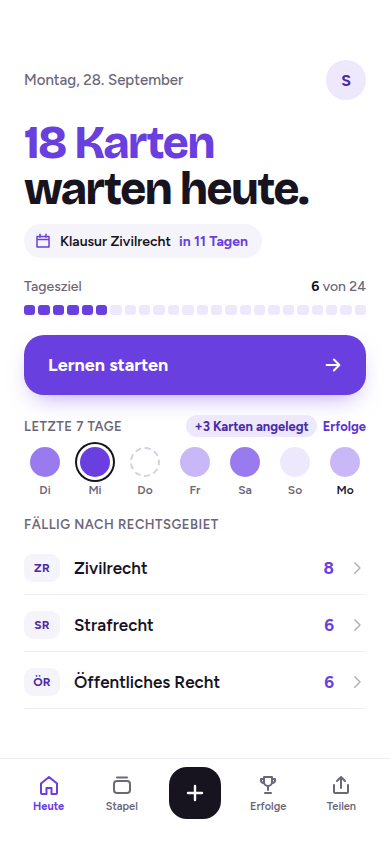
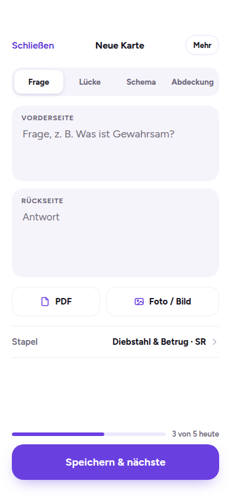
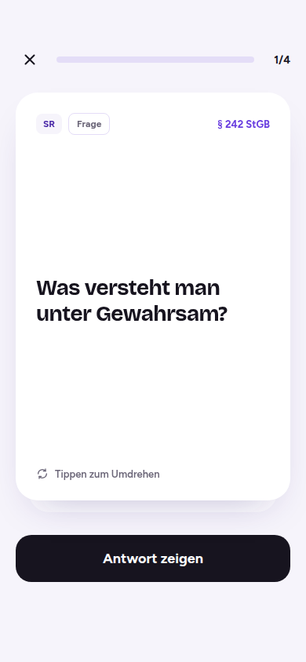
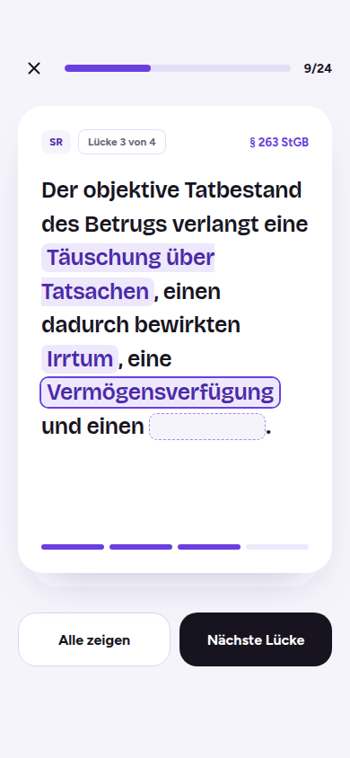
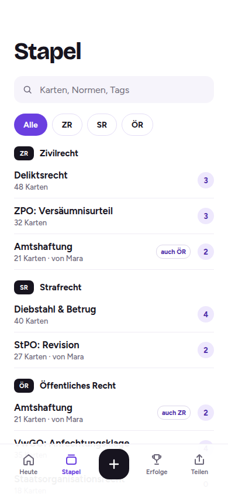
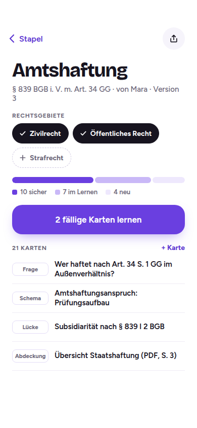
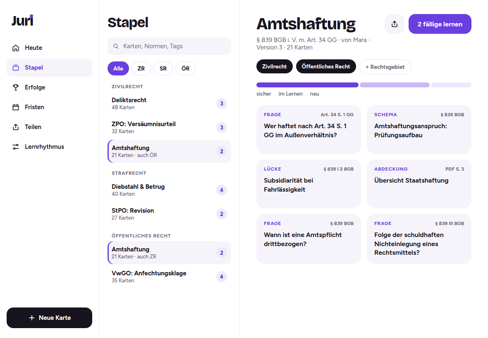
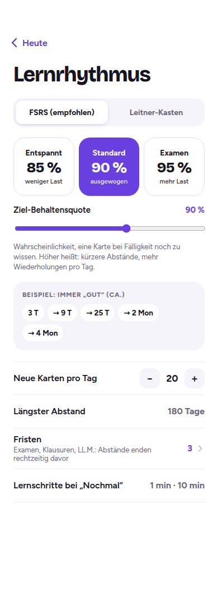

<!-- status: Loslegen, Heute, Karten anlegen (Frage, Lücke, Schema, Notiz), Lernen, Lernrhythmus und Stapel sind gegen die App geprüft (bis M5). Die übrigen Kapitel sind Entwürfe nach den Design-Screens und werden im genannten Meilenstein geprüft. -->

# Loslegen

In zwei Minuten installiert, ohne Konto und ohne App Store.

## Juri auf dem iPhone installieren

<!-- status: M1, Schritte wie in der App (Installieren.dc.html) nach Apple Support; Wortlaut auf iPhone 14 und 16 Pro Max pruefen -->

1. In **Safari** die Adresse `svenf-png.github.io/Juri` öffnen; Juri zeigt dort diese Anleitung
2. Auf **„Teilen“** tippen, je nach Ansicht zuerst auf **„•••“**
3. **„Zum Home-Bildschirm“** wählen; fehlt der Eintrag, in der Liste nach unten blättern
4. **„Hinzufügen“** tippen
5. Juri ab jetzt nur noch über das neue Symbol öffnen

> **Notizen:** Wichtig ist Schritt 5: Juri speichert deine Daten in der installierten App, nicht im Safari-Tab. Im Safari-Tab legt Juri deshalb gar keine Daten an. Quelle der Schritte: Apple Support, „Turn a website into an app in Safari on iPhone“.

## Juri auf dem iPad installieren

<!-- status: entwurf, auf iPad Air 11 Zoll pruefen in M0 und M12 -->

1. In **Safari** `svenf-png.github.io/Juri` öffnen
2. Oben rechts auf das **Teilen-Symbol** tippen
3. **„Zum Home-Bildschirm“**, dann **„Hinzufügen“**
4. Juri über das neue Symbol öffnen

> **Notizen:** iPhone und iPad haben jeweils eigene Daten. Um Karten von einem Gerät auf das andere zu bringen, nutzt du Backup oder Teilen (Kapitel „Deine Daten“).

## Warum installieren?

- Safari und die installierte App haben **getrennte Speicher**
- Nur installiert bleiben deine Daten dauerhaft geschützt
- Vollbild, schneller Start, funktioniert ohne Internet
- Im Safari-Tab zeigt Juri deshalb zuerst diese Anleitung

## Ausprobieren mit Beispielstapeln

<!-- status: M3 in der Testinstanz umgesetzt, als Datei zum Importieren ab M10 -->

- Die Testinstanz „Juri Test“ hat **6 Demo-Stapel** mit 40 Karten zu ZR, SR und ÖR, darunter einen mit fünf Prüfungsschemata
- In den Einstellungen unter „Testdaten“: **„Demo-Stapel hinzufügen“**
- Die Inhalte sind als **Demo** gekennzeichnet; sie ersetzen kein Skript
- Jeden Stapel kannst du einzeln wieder löschen
- Als Datei zum Importieren kommen sie mit dem Teilen (Kapitel „Teilen“)

> **Notizen:** Die Testinstanz liegt unter svenf-png.github.io/Juri/test/. Sie ist eine eigene App mit eigenen Daten und berührt deine echten Lerndaten nicht. Die Karteninhalte sind noch nicht fachlich geprüft (testdaten/README.md).

## Der erste Start

<!-- status: M1 umgesetzt (Onboarding.dc.html), Rechtsgebiete M3 -->

- Juri fragt nach deinem **Vornamen** (für Initiale und High fives)
- Kein Passwort, keine E-Mail, kein Konto
- Oben rechts steht danach deine **Initiale**: Tippen öffnet die Einstellungen
- Rechtsgebiete legst du mit dem ersten Stapel an: Juri schlägt **ZR, SR und ÖR** vor

## Heute

<!-- layout: bild-gross -->
<!-- status: M2 umgesetzt (Main.dc.html, iPadHeute.dc.html); Karten (M3) und Fälligkeit (M4) sind echt; Fristen (M8), Ziele und Verlauf (M9) und High fives (M11) folgen. Bild mit Beispieldaten. -->

- Oben: wie viele Karten heute warten, darunter deine **nächste Frist**
- **Tagesziel** als Leiste, darunter **Lernen starten**
- **Letzte 7 Tage:** je dunkler, desto mehr gelernt; der Ring markiert deinen Rekordtag
- Ein neuer Tag beginnt um **4 Uhr** morgens, nicht um Mitternacht

> **Notizen:** Ohne Karten zeigt Heute „Noch keine Karten.“ und einen Knopf zum Anlegen. Ist alles gelernt, steht dort „Alles erledigt für heute.“ Wer nach Mitternacht noch lernt, lernt für den Vortag.

## Navigation

<!-- layout: zwei-spalten -->
<!-- status: M2 umgesetzt; die Bereiche hinter Stapel, Erfolge, Teilen, Fristen und Lernrhythmus füllen spätere Meilensteine -->

- **iPhone:** Leiste unten mit Heute, Stapel, Erfolge, Teilen und dem schwarzen **Plus** für neue Karten
- **iPad:** Seitenleiste links, zusätzlich Fristen und Lernrhythmus; rechts nächste Fristen und High fives
- Deine **Initiale** (iPhone) bzw. **Lernrhythmus** (iPad) führt zu den Einstellungen

# Karten anlegen

Vier Kartentypen für die vier Arten, wie Jura gelernt wird.

## Deine erste Karte

<!-- status: M3 umgesetzt (Erstellen.dc.html), Schema und Abdeckung inaktiv bis M5 und M6 -->

- Unten in der Mitte auf **+** tippen
- Typ wählen: **Frage** oder **Lücke** (Schema und Abdeckung kommen später)
- Vorderseite und Rückseite ausfüllen, unten den **Stapel** wählen
- **„Speichern & nächste“**: die nächste Karte ist sofort bereit
- Fehlt etwas, steht der Hinweis direkt am Feld
- Jede gespeicherte Karte zählt für dein Tagesziel „Anlegen“ (5 pro Tag)

> **Notizen:** Noch kein Stapel? Beim Speichern öffnet sich die Stapelwahl mit „Neuer Stapel“. Nach „Speichern & nächste“ bleiben Typ, Stapel und Tags stehen, Inhalt und Norm sind leer.

## Lückentext

<!-- status: M3 umgesetzt (Erstellen.dc.html), Lernen mit Lücken M4 umgesetzt (Luecke.dc.html) -->

- Typ **Lücke** wählen und den Satz eingeben
- Wort oder Wortgruppe markieren, **„Markierung wird Lücke“** tippen
- Unter dem Text stehen die Lücken; **✕** entfernt eine, der Text bleibt
- **Jede Lücke wird eine eigene Abfrage:** drei Lücken sind drei Abfragen
- Beim Lernen bekommt jede Lücke ihren eigenen Rhythmus

## Prüfungsschema

<!-- status: M5 umgesetzt (SchemaEditor.dc.html und Artboards SchemaPunkt, SchemaVerknuepfen, SchemaNeueKarte, ADR-009) -->

- Typ **Schema** wählen, Titel eingeben, **„Gliederung bearbeiten“**
- **„+“** legt einen Punkt an; mit den Pfeilen **ein- und ausrücken** (1., a), aa)), bis zu drei Ebenen und 60 Punkte
- Einen Punkt antippen, um ihn zu wählen, **nochmal antippen**, um Text, Norm und **Inhalt** einzutragen; dort lässt er sich auch nach oben und unten schieben oder löschen
- Mit dem Ketten-Symbol einen Punkt mit einer anderen Karte **verknüpfen**: Suche, Karte antippen; eine neue Karte lässt sich gleich anlegen
- **„Sichern“** übernimmt die Gliederung, gespeichert wird die Karte mit „Speichern“

> **Notizen:** Ein Schema ist eine Abfrage, egal wie viele Punkte es hat. Leere Punkte lässt Juri beim Sichern weg. „Zurück“ fragt nach, wenn du etwas geändert hast.

## Aus PDF oder Foto

<!-- status: entwurf nach Erstellen.dc.html und iPadErstellen.dc.html, pruefen in M6 -->

- **PDF** oder **Foto** wählen, z. B. eine Skriptseite
- **Abdeckung:** Felder aufziehen, die beim Lernen verdeckt sind
- Auf dem iPad: Text im PDF markieren, dann **„Als Frage“**, **„Als Antwort“** oder **„Als Lücke“**
- Die Quelle (Datei und Seite) bleibt an der Karte gespeichert

## Einfach und Mehr

<!-- status: M3 umgesetzt, Notiz M4 umgesetzt (ErstellenNotiz, AntwortNotiz) -->

- Standard ist **Einfach**: nur das Nötigste
- **Mehr** blendet **Norm** und **Tags** ein, z. B. „§ 242 StGB“ und „#Klausur #AG“
- Tags und Normen findest du später mit der Suche
- **Notiz** für Merksätze und Eselsbrücken: Sie erscheint beim Lernen unter der Antwort

# Lernen

## Eine Lernrunde

<!-- layout: bild-gross -->
<!-- status: M4 umgesetzt (Lernen.dc.html), Bild mit Beispieldaten aus der App -->

- Auf **Heute** siehst du, wie viele Karten warten; **„Lernen starten“** öffnet die Runde
- Frage lesen, im Kopf antworten, Karte **antippen** oder **„Antwort zeigen“**
- Ehrlich bewerten, die nächste Karte kommt von selbst
- Oben zeigen Leiste und Zähler, wie weit du bist; das **X** beendet die Runde
- Am Ende: kurze Feier und Zusammenfassung

> **Notizen:** In einer Runde stehen fällige Karten und bis zu 20 neue am Tag (einstellbar). Überfällige kommen zuerst, neue zuletzt.

## Die vier Bewertungen

<!-- layout: tabelle -->
<!-- status: M4 umgesetzt, Abstände nach FSRS -->

| Knopf       | Bedeutung        | Folge                                              |
| ----------- | ---------------- | -------------------------------------------------- |
| **Nochmal** | Nicht gewusst    | Kommt in dieser Runde nach etwa drei Karten wieder |
| **Schwer**  | Mit Mühe gewusst | Kurzer Abstand                                     |
| **Gut**     | Gewusst          | Normaler Abstand                                   |
| **Leicht**  | Sofort gewusst   | Langer Abstand                                     |

> **Notizen:** Unter jedem Knopf steht, wann die Karte wiederkommt, z. B. „10 min“ oder „5 T“ für fünf Tage. Die Zahl ist genau der Abstand, der nach dem Tippen gilt. Eine Karte mit „Nochmal“ kommt so lange wieder, bis du mindestens „Schwer“ wählst. Kein Abstand ist länger als 180 Tage.

## Gesten und Tastatur

<!-- status: M4 umgesetzt -->

- **Tippen:** Karte umdrehen
- **Nach links wischen:** Nochmal, **nach rechts wischen:** Gut
- **„Letzte Bewertung zurücknehmen“** unter „Antwort zeigen“ macht Bewertungen rückgängig, auch mehrere nacheinander
- Mit iPad-Tastatur: **Leertaste** umdrehen, **1 bis 4** bewerten, **Pfeile** links und rechts, **⌘ Z** zurücknehmen, **Esc** beenden
- Das **X** oben fragt nach, ob du aufhören willst; alle Bewertungen sind schon gespeichert

## Lückentext, Schema und Abdeckung

<!-- layout: bild-gross -->
<!-- status: Lückentext M4 umgesetzt (Luecke.dc.html), Schema M5 umgesetzt (Schema.dc.html), Abdeckung M6 -->

- **Lückentext:** Sind mehrere Lücken einer Karte fällig, deckst du sie mit **„Nächste Lücke“** der Reihe nach auf oder mit **„Alle zeigen“** alle; dann bewertest du einmal
- Die Bewertung gilt für jede fällige Lücke einzeln
- **Schema:** **„Nächster Punkt“** deckt die Gliederung Punkt für Punkt mit Norm und Inhalt auf, **„Alle zeigen“** alles; erst dann bewertest du einmal
- Ein Punkt mit dem Chip **„Karte“** zeigt die verknüpfte Karte in einem Blatt; **„Karte lernen“** übt sie einzeln
- **Abdeckung** (M6): Das gefragte Feld pulsiert, antippen deckt es auf

## Das Ende einer Runde

<!-- status: M4 umgesetzt (Lernen.dc.html, „Geschafft.“) -->

- **„Geschafft.“** mit Ring, Funken und Bilanz: wie oft Nochmal, Schwer, Gut und Leicht
- Darunter, wann die nächste Runde ansteht („Nächste Runde: morgen“)
- Kommen Karten noch heute wieder (kurze Lernschritte), bietet Juri **„N Karten noch einmal lernen“** an
- Danach zeigt **Heute** „Alles erledigt für heute.“

> **Notizen:** Die große Feier „Tagesziel erreicht“ mit Serie und Meilensteinen kommt mit den Erfolgen (M9).

# Stapel und Rechtsgebiete

## Stapel ordnen

<!-- status: M3 umgesetzt (Bibliothek.dc.html, Stapel.dc.html, iPadStapel.dc.html) -->

- Unter **Stapel** siehst du alle Stapel, gruppiert nach Rechtsgebiet
- **„+ Stapel“** legt einen an: Name, Normen (optional), mindestens ein Rechtsgebiet
- Ein Stapel kann in **mehreren Rechtsgebieten** liegen, z. B. Amtshaftung in ZR und ÖR
- Im Stapel die Rechtsgebiete an- und abwählen; das letzte bleibt
- Der Balken zeigt: **sicher**, **im Lernen**, **neu**
- Auf dem iPad stehen Liste und Stapel nebeneinander

> **Notizen:** Die Zahl rechts an jedem Stapel sind die heute fälligen Karten. Bis zum Lernen (M4) zählt jede neue Karte als fällig.

## Ein Stapel im Detail

<!-- status: M3 umgesetzt (Stapel.dc.html) -->

- Oben: Name, Normen und die Rechtsgebiete zum Umschalten
- Der große Knopf startet das Lernen (ab M4) oder legt die erste Karte an
- Darunter alle Karten; antippen öffnet sie zum Bearbeiten
- **„⋯“** neben dem Namen: Stapel bearbeiten oder löschen
- Löschen entfernt alle Karten und den Lernfortschritt und lässt sich nicht rückgängig machen

## Karte bearbeiten und löschen

<!-- status: M3 umgesetzt (Erstellen.dc.html im Bearbeiten-Modus) -->

- Eine Karte im Stapel oder in den Suchtreffern antippen
- Inhalt, Norm, Tags und Stapel lassen sich ändern; der Kartentyp bleibt
- Bei Lückentexten bleiben die Abfragen der behaltenen Lücken erhalten
- **„Karte löschen“** fragt nach und nennt, wie viele Abfragen entfallen; ist die Karte in Schemas verknüpft, steht dort, in welchen und an wie vielen Punkten. Die Punkte bleiben, nur die Verknüpfung entfällt

## Suchen

<!-- status: M3 umgesetzt -->

- Die Suche oben in der Stapel-Übersicht findet Karten in Vorderseite, Rückseite, Lücken, Normen, Tags und Stapelnamen
- Groß- und Kleinschreibung und Umlaute spielen keine Rolle
- Mehrere Wörter müssen alle vorkommen
- Ohne Treffer sagt Juri, wo gesucht wurde

## Rechtsgebiete verwalten

<!-- status: M3 umgesetzt -->

- Der **Stift** hinter den Filtern öffnet die Liste der Rechtsgebiete
- Anlegen mit Kürzel und Name; ZR, SR und ÖR gibt es als Vorschläge
- Umbenennen ändert alles sofort, weil die Stapel auf das Rechtsgebiet verweisen
- Löschen geht nur, wenn kein Stapel ausschließlich dort liegt; Juri nennt sie dir

# Lernrhythmus und Fristen

## Lernrhythmus einstellen

<!-- layout: bild-gross -->
<!-- status: M4 umgesetzt (Einstellungen.dc.html), Bild mit Beispieldaten aus der App -->

- **iPhone:** Initiale oben rechts, dann **„Lernrhythmus“**; **iPad:** Seitenleiste **„Lernrhythmus“**
- **FSRS (empfohlen)** oder **Leitner-Kasten** wählen
- Voreinstellungen: **Entspannt 85 %**, **Standard 90 %**, **Examen 95 %**, dazwischen mit dem Regler
- Das Beispiel zeigt die Abstände, wenn du immer „Gut“ wählst
- **Neue Karten pro Tag:** in Fünferschritten von 0 bis 100

> **Notizen:** Die Prozentzahl ist die Wahrscheinlichkeit, eine Karte bei Fälligkeit noch zu wissen. Höher heißt kürzere Abstände und mehr Wiederholungen pro Tag. Der längste Abstand ist 180 Tage, „Nochmal“ führt über Lernschritte von 1 und 10 Minuten.

## Leitner-Kasten

<!-- status: M4 umgesetzt (Einstellungen.dc.html, LeitnerFach) -->

- Fünf Fächer mit festen Abständen: 1, 3, 7, 14 und 30 Tage
- **Gewusst** (Gut oder Leicht) rückt ein Fach weiter, **Schwer** lässt die Karte, **Nochmal** schickt sie zurück in Fach 1
- **Fach antippen**, um die Tage zu ändern; die Fächer bleiben aufsteigend
- **Wechsel jederzeit:** Juri rechnet beide Verfahren mit, dabei geht nichts verloren

## Fristen anlegen

<!-- status: entwurf nach Fristen.dc.html, pruefen in M8 -->

- **„+ Frist hinzufügen“**: Examen, Klausur, LL.M. oder Eigene
- Name und Datum eintragen (das Datum kann auch später folgen)
- **Umfang** wählen: Rechtsgebiete, Stapel oder Tags
- **Endspurt** an: In den letzten 7 Tagen kommt jede Karte noch einmal
- Auf **Heute** zeigt ein Hinweis, wie viele Tage noch bleiben

# Teilen

## Einen Stapel verschicken

<!-- status: entwurf nach Teilen.dc.html, pruefen in M10 -->

- Im Stapel oben rechts auf **Teilen** tippen
- Optional **„Eigene Notizen mitschicken“** einschalten
- **„AirDrop, Nachrichten, Mail …“** öffnet das Teilen-Menü von iOS
- Dein Lernfortschritt bleibt **immer privat**

## Einen Stapel empfangen

<!-- status: entwurf, Anleitung wird im Canvas entworfen, pruefen in M10 -->

1. Die `.juri`-Datei in AirDrop oder Nachrichten **„In Dateien sichern“**
2. Juri öffnen, **Teilen**, dann **„Datei öffnen“**
3. Datei auswählen (sie steht unter „Zuletzt“ oben)
4. **„Aktualisieren“** (dein Fortschritt bleibt) oder **„Als Kopie anlegen“**

> **Notizen:** iOS lässt Web-Apps nicht direkt im Teilen-Menü erscheinen. Deshalb der kurze Umweg über die Dateien-App.

# Erfolge

## Serie, Heatmap, Meilensteine

<!-- status: entwurf nach Erfolge.dc.html, pruefen in M9 -->

- **Serie:** Tage in Folge mit Lernen oder Anlegen; ein Pausentag pro Woche ist frei
- **Heatmap:** Wie viel du an jedem Tag gelernt oder angelegt hast
- Der **Rekordtag** ist mit einem Ring markiert
- **Meilensteine** wie „Erste Karte“ oder „1.000 Wiederholungen“

## High fives

<!-- status: entwurf nach HighFive.dc.html, pruefen in M11 -->

- Unter **Erfolge** siehst du neue Erfolge deiner Lernpartner
- Mit einem Tipp ein **High five** geben, oder einfach so
- **„Per Nachricht senden“** verschickt ein Bild, z. B. über WhatsApp
- High fives reisen auch in geteilten `.juri`-Dateien mit

# Deine Daten

## Wo deine Daten liegen

- Alles liegt **nur auf deinem Gerät**, in der installierten App
- Kein Server, kein Konto, niemand sonst hat Zugriff
- iPhone und iPad haben jeweils eigene Daten
- Entfernst du Juri vom Home-Bildschirm, sind die Daten weg: vorher ein Backup machen

<!-- status: Verhalten beim Entfernen der App im Geraete-Check M0 pruefen und Aussage ggf. anpassen -->

## Backup

<!-- status: M1 umgesetzt (Profil.dc.html, BackupExport.dc.html, BackupImport.dc.html); Teilen-Menue auf dem Geraet pruefen -->

- In den **Einstellungen**: **Backup erstellen**, dann **„Sichern oder teilen“**
- Im Teilen-Menü **„In Dateien sichern“** und dort **iCloud Drive** wählen
- Juri erinnert dich nach 14 Tagen oder 50 neuen Karten („Zeit für ein neues Backup“)
- Wiederherstellen: **Backup einspielen**, Datei wählen, bestätigen. Das Backup **ersetzt** alle Daten auf dem Gerät

> **Notizen:** Das Backup ist eine Datei mit der Endung .juri-backup. Juri prüft sie vollständig, bevor etwas überschrieben wird; eine falsche oder beschädigte Datei ändert nichts. Unter „Speicher“ zeigen die Einstellungen, ob iOS die Daten dauerhaft aufbewahrt und wie viel Platz sie belegen.

## Version und Entwicklungsstand

<!-- status: M4 umgesetzt (Artboard Entwicklungsstand), Zahlen ab 0.6.0 laufen mit -->

- Unten in den **Einstellungen** steht die **Version** der App
- **Entwicklungsstand** zeigt die Schritte M0 bis M13: fertig mit Haken und Version, der nächste „in Arbeit“, die übrigen „ab“ ihrer Version
- Zugeklappt siehst du nur „6 von 14 Schritten fertig“ und einen Balken

> **Notizen:** Die Versionen der kommenden Schritte sind vorläufig. Die Liste folgt der Versionsnummer der App und braucht keine Pflege.
