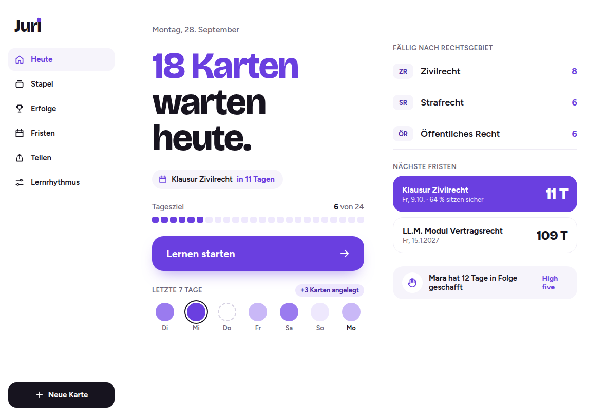

# Die Idee

Eine Lern-App, die so ruhig und klar ist wie ein gutes Skript.

## Worum es geht

- Karteikarten-App für das juristische Referendariat
- Läuft auf iPhone und iPad, installiert vom Home-Bildschirm
- Minimalistisch und ästhetisch, motivierend statt fordernd
- Alle Daten bleiben auf dem eigenen Gerät
- Stapel teilen von Mensch zu Mensch, als Datei

> **Notizen:** Juri richtet sich an Referendarinnen und Referendare, die viel Stoff in wenig Zeit wiederholen müssen. Die App soll in Pausen und unterwegs funktionieren, ohne Konto und ohne Cloud.

## Was Juri kann

<!-- layout: zwei-spalten -->

- **Vier Kartentypen:** Frage und Antwort, Lückentext, Prüfungsschema, PDF oder Bild mit Abdeckung
- **Lernrhythmus:** FSRS (modernes Wiederholungsverfahren) oder klassischer Leitner-Kasten
- **Fristen:** Examen, Klausur, LL.M. oder eigene; der Rhythmus endet rechtzeitig davor
- **Erfolge:** Serie, Heatmap, Rekordtage, Meilensteine
- **Teilen:** Stapel als `.juri`-Datei per AirDrop, Nachrichten oder Mail
- **High fives:** kleine Anerkennung unter Lernpartnern

> **Notizen:** Die vier Kartentypen decken ab, wie Juristinnen und Juristen tatsächlich lernen: Definitionen, Normtexte mit Lücken, Prüfungsaufbauten und Übersichten aus Skripten.

# Prinzipien

## Lokal statt Cloud

- Kein Konto, kein Login, kein Server für Nutzerdaten
- Karten, Fortschritt und Profil liegen nur auf dem Gerät
- Sicherung per Backup-Datei, z. B. in iCloud Drive
- Lernfortschritt bleibt beim Teilen immer privat

> **Notizen:** Ohne Server gibt es keine Datenbank, die angegriffen oder verkauft werden kann, und keine laufenden Kosten. Die Kehrseite: Sicherungen liegen in der Verantwortung der Nutzer. Juri erinnert deshalb regelmäßig an ein Backup.

## Positiv statt Druck

- Keine Verlust-Botschaften, keine Ranglisten
- Ein freier Pausentag pro Woche hält die Serie
- Auch das Anlegen von Karten wird belohnt
- Kleine Feiern: Ring, Haken, Funken, leuchtender Tag

> **Notizen:** Das Referendariat ist belastend genug. Juri motiviert über sichtbaren Fortschritt und Anerkennung, nicht über Angst, etwas zu verlieren.

## Teilen von Mensch zu Mensch

- Stapel werden als Datei verschickt, nicht über einen Katalog
- Empfänger wählen: aktualisieren oder als Kopie anlegen
- Beim Aktualisieren bleibt der eigene Fortschritt erhalten
- High fives und Erfolge reisen in den Dateien mit

# Design

## Farben

<!-- layout: tabelle -->

| Rolle          | Farbe        | Wert      |
| -------------- | ------------ | --------- |
| Aktion, Akzent | Veilchen     | `#6A3FE0` |
| Text, Auswahl  | Tinte        | `#17141F` |
| Sekundärtext   | Grau-Violett | `#6B6678` |
| Flächen        | Hell         | `#F6F4FB` |
| Linien         | Sehr hell    | `#EFECF5` |

> **Notizen:** Nur helles Design, kein Dark Mode. Alle Textfarben erreichen mindestens ein Kontrastverhältnis von 4,5 zu 1. Die Bewertungsknöpfe unterscheiden sich über Helligkeit statt über Ampelfarben.

## Schrift und Form

- **Bricolage Grotesque** für Überschriften, Zahlen und Kartenfragen
- **Figtree** für Antworten und Bedienelemente
- Runde Formen: Karte 28 px, Knopf 20 px, Feld 14 bis 16 px
- Beide Schriften unter freier Lizenz (OFL), in der App mitgeliefert

## Bewegung

- Karte umdrehen: 620 ms mit leichtem Nachschwung
- Karte wegfliegen: 420 ms, nach rechts oder nach hinten
- Antippen: 180 ms, leichtes Eindrücken
- Erfolg: Ring, dann Haken, dann Funken
- Bei „Bewegung reduzieren“ in iOS sind alle Animationen aus

## So sieht es aus

<!-- layout: bild-gross -->
<!-- status: M2, Bild automatisch aus der App (npm run docs:bilder) mit den Beispieldaten der Designs -->

> **Notizen:** Das Bild stammt aus der App, nicht aus dem Design-Werkzeug. Ein Test vergleicht es bei jeder Änderung Pixel für Pixel mit dem Design.

# Technik

## Warum eine Web-App

- Kein App Store nötig, Installation direkt aus Safari
- Ein Code für iPhone, iPad und Desktop-Browser
- Installierte Web-Apps laufen auf iOS offline und im Vollbild
- Grenzen: kein Teilen-Ziel, kein Hintergrund-Sync, Push nur mit Server

> **Notizen:** Seit iOS 17.4 laufen Home-Bildschirm-Web-Apps auch in der EU weiter. Installierte Web-Apps sind von der 7-Tage-Löschregel von Safari ausgenommen. Quellen stehen in docs/ARCHITEKTUR.md.

## Aufbau in Schichten

<!-- layout: tabelle -->

| Schicht         | Aufgabe                                                      |
| --------------- | ------------------------------------------------------------ |
| Oberfläche      | Screens, Komponenten, Animationen                            |
| Anwendungsfälle | Lernen, Erstellen, Teilen, Fristen, Fortschritt              |
| Fachlogik       | Lernalgorithmus, Fristen, Serie, Merge; vollständig getestet |
| Daten           | Lokale Datenbank (IndexedDB), Sicherung                      |
| Plattform       | Teilen, Dateien, Speicher, PDF                               |

> **Notizen:** Die Fachlogik hängt nicht vom Browser ab und wird mit automatischen Tests zu mindestens 90 Prozent abgedeckt.

## Wie der Lernrhythmus funktioniert

- **FSRS** schätzt für jede Karte, wie sicher sie noch sitzt
- Sie kommt wieder, kurz bevor diese Sicherheit unter das Ziel fällt
- Ziel einstellbar: 85, 90 oder 95 Prozent (Entspannt, Standard, Examen)
- **Leitner** als Alternative: fünf Fächer mit festen Abständen
- Wechsel zwischen beiden jederzeit ohne Datenverlust

> **Notizen:** FSRS (Free Spaced Repetition Scheduler) ist ein offenes Verfahren, das auch Anki verwendet. Juri nutzt die Bibliothek ts-fsrs unter MIT-Lizenz.

## Fristen

- Umfang wählen: Rechtsgebiete, Stapel oder Tags
- **Deckelung:** Keine Wiederholung wird hinter die Frist geplant
- **Endspurt:** In den letzten 7 Tagen kommt jede Karte noch einmal
- Anzeige: Countdown und Anteil, der am Stichtag sicher sitzt
- Nach der Frist läuft der normale Rhythmus weiter

## Daten und Backup

- Alle Daten in der Gerätedatenbank (IndexedDB), jede Tabelle mit geprüftem Schema
- Neue Versionen heben die Datenbank an, **ältere Backups gleich mit**
- Backup = eine Datei (.juri-backup), vor dem Einspielen vollständig geprüft
- Einspielen in einem Schritt: klappt es nicht, bleibt alles wie vorher

> **Notizen:** Dieselbe Umformung gilt für die Datenbank und für alte Backups, so bleibt ein Backup aus dem ersten Monat auch nach vielen Updates einspielbar. Der Roundtrip ist byte-genau getestet: Backup, Einspielen und erneutes Backup ergeben dieselbe Datei.

## Teilen ohne Server

- Format `.juri`: ein ZIP mit Beschreibung, Karten und Medien
- Verschicken über das Teilen-Menü von iOS
- Empfangen: Datei in „Dateien“ sichern, in Juri importieren
- Jede Datei wird vor dem Import streng geprüft
- Inhalte werden nie als ausführbarer Code behandelt

> **Notizen:** iOS erlaubt Web-Apps nicht, im Teilen-Menü als Ziel zu erscheinen. Der Umweg über die Dateien-App ist deshalb nötig; Juri erklärt ihn einmalig mit einer Anleitung.

## Sicherheit

- Keine Nutzerdaten auf Servern, keine Geheimnisse im Code
- Öffentlicher Code ist kein Risiko: Web-Apps sind ohnehin einsehbar
- Wichtigster Schutz: das GitHub-Konto (Zwei-Faktor, Regeln für `main`)
- Abhängigkeiten minimal, fest versioniert und überwacht
- Schutz gegen Einbetten in fremde Seiten in der App selbst

## Testen

- Automatische Tests für Fachlogik, Abläufe und Aussehen
- **Pixelvergleich:** Design und App im selben Browser gerendert, auch in Safaris Engine WebKit
- Geprüft auf iPhone 14, iPhone 16 Pro Max und iPad Air 11 Zoll
- **Testinstanz** „Juri Test“ unter `svenf-png.github.io/Juri/test/`, getrennt von echten Daten
- Dort per Knopfdruck: 26 Wochen Lernverlauf, Fristen, High fives, 5.000 Karten
- **Demo-Stapel** mit echten juristischen Inhalten, als Demo gekennzeichnet

> **Notizen:** Der Heute-Screen weicht in Chromium um 0 Pixel vom Design ab; bewusste Korrekturen am Design sind im Test dokumentiert. Erfolge, Heatmap und Fristen sieht man sonst erst nach Wochen echter Nutzung. Die Testinstanz macht alle Screens sofort prüfbar, ohne die eigenen Lerndaten anzufassen. Normtexte in den Demo-PDFs sind als amtliche Werke nach § 5 UrhG gemeinfrei.

# Entscheidungen

## Getroffene Entscheidungen

<!-- layout: tabelle -->

| Thema                  | Entscheidung                                                      |
| ---------------------- | ----------------------------------------------------------------- |
| Hosting                | GitHub Pages unter `svenf-png.github.io/Juri`                     |
| Lückentext             | Lücken einer Karte gebündelt, eine Bewertung                      |
| Schema                 | Eine Abfrage pro Schema, mit Inhalt je Punkt                      |
| Serie                  | Anlegen zählt, leere Tage brechen nicht, Gerätezeitzone           |
| Mindestversion, Lizenz | iOS und iPadOS 18, MIT                                            |
| Testdaten              | Demo-Stapel, Demo-Profil, großer Datensatz in eigener Testinstanz |

> **Notizen:** Alle Entscheidungen mit Begründung stehen in docs/ARCHITEKTUR.md, Abschnitt 2.

# Fahrplan

## Meilensteine

<!-- layout: tabelle -->

| Phase      | Inhalt                                                          |
| ---------- | --------------------------------------------------------------- |
| M0 bis M2  | Fundament, Daten und Backup, Oberfläche und Heute-Screen        |
| M3 bis M5  | Karten und Stapel, Lern-Engine, Prüfungsschemata                |
| M6 bis M8  | PDF und Abdeckung, Fristen, Erfolge                             |
| M9 bis M11 | Teilen und Import, High fives, Feinschliff und Veröffentlichung |

> **Notizen:** Geschätzt rund 35 Personentage. Jeder Meilenstein endet mit grünen Tests, einer kurzen Demo und aktualisierter Dokumentation.

## Stand heute

<!-- status: bei jedem Meilenstein aktualisieren -->

- **M0 fertig:** Grundgerüst, Design-Tokens, Schriften, App-Icon, Styleguide, Testinstanz mit Geräte-Check
- **M1 fertig:** Datenbank mit Migrationen, Onboarding, Install-Anleitung im Safari-Tab, Speicheranzeige, Backup erstellen und einspielen
- **M2 fertig:** Tab-Bar und Sidebar, Heute-Screen pixelgleich zum Design, Lerntag ab 4 Uhr
- Automatische Prüfung bei jeder Änderung: 191 Unit-Tests, 29 E2E-Szenarien auf iPhone- und iPad-Größen
- Geräte-Check M0 (iPhone 16 Pro Max): Datenbank, Teilen, Kalender und Fotos funktionieren, Bilder werden als JPEG statt WebP gespeichert; einige Punkte werden nachgetestet
- Nächster Schritt: Gerätetest von M0 bis M2 auf iPhone und iPad, dann M3 (Karten und Stapel)
