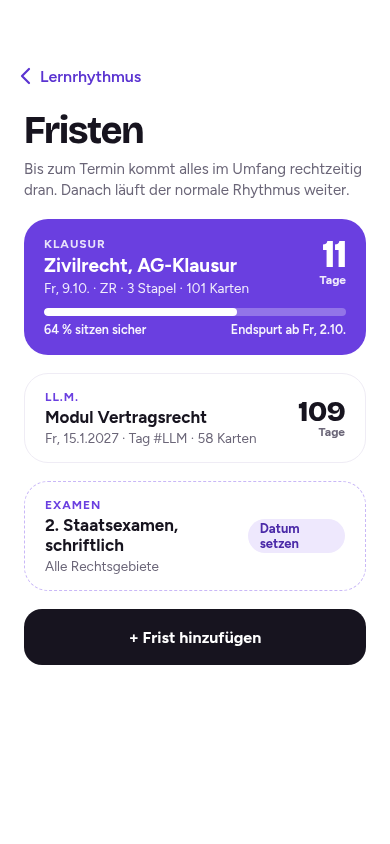
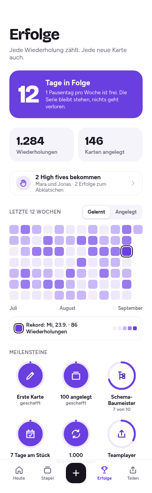
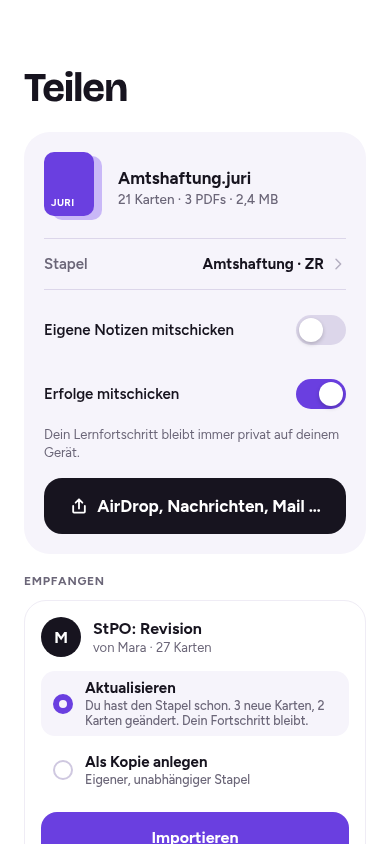

# Die Idee

Eine Lern-App, die so ruhig und klar ist wie ein gutes Skript.

## Worum es geht

- Karteikarten-App für das juristische Referendariat
- Läuft auf iPhone und iPad, installiert vom Home-Bildschirm
- Minimalistisch und ästhetisch, motivierend statt fordernd
- Alle Daten bleiben auf dem eigenen Gerät
- Stapel teilen von Mensch zu Mensch, als Datei

> **Notizen:** Juri richtet sich an Referendarinnen und Referendare, die viel Stoff in wenig Zeit wiederholen müssen. Die App soll in Pausen und unterwegs funktionieren, ohne Konto und ohne Cloud.

## Was Juri kann

<!-- layout: zwei-spalten -->

- **Vier Kartentypen:** Frage und Antwort, Lückentext, Prüfungsschema, PDF oder Bild mit Abdeckung
- **Lernrhythmus:** FSRS (modernes Wiederholungsverfahren) oder klassischer Leitner-Kasten
- **Fristen:** Examen, Klausur, LL.M. oder eigene; der Rhythmus endet rechtzeitig davor
- **Erfolge:** Serie, Heatmap, Rekordtage, Meilensteine
- **Teilen:** Stapel als `.juri`-Datei per AirDrop, Nachrichten oder Mail
- **High fives:** kleine Anerkennung unter Lernpartnern

> **Notizen:** Die vier Kartentypen decken ab, wie Juristinnen und Juristen tatsächlich lernen: Definitionen, Normtexte mit Lücken, Prüfungsaufbauten und Übersichten aus Skripten.

# Prinzipien

## Lokal statt Cloud

- Kein Konto, kein Login, kein Server für Nutzerdaten
- Karten, Fortschritt und Profil liegen nur auf dem Gerät
- Sicherung per Backup-Datei, z. B. in iCloud Drive
- Lernfortschritt bleibt beim Teilen immer privat

> **Notizen:** Ohne Server gibt es keine Datenbank, die angegriffen oder verkauft werden kann, und keine laufenden Kosten. Die Kehrseite: Sicherungen liegen in der Verantwortung der Nutzer. Juri erinnert deshalb regelmäßig an ein Backup.

## Positiv statt Druck

- Keine Verlust-Botschaften, keine Ranglisten
- Ein freier Pausentag pro Woche hält die Serie
- Auch das Anlegen von Karten wird belohnt
- Kleine Feiern: Ring, Haken, Funken, leuchtender Tag

> **Notizen:** Das Referendariat ist belastend genug. Juri motiviert über sichtbaren Fortschritt und Anerkennung, nicht über Angst, etwas zu verlieren.

## Teilen von Mensch zu Mensch

- Stapel werden als Datei verschickt, nicht über einen Katalog
- Empfänger wählen: aktualisieren oder als Kopie anlegen
- Beim Aktualisieren bleibt der eigene Fortschritt erhalten
- High fives und Erfolge reisen in den Dateien mit (abschaltbar), dazu die kleine Gruß-Datei

# Design

## Farben

<!-- layout: tabelle -->

| Rolle          | Farbe        | Wert      |
| -------------- | ------------ | --------- |
| Aktion, Akzent | Veilchen     | `#6A3FE0` |
| Text, Auswahl  | Tinte        | `#17141F` |
| Sekundärtext   | Grau-Violett | `#6B6678` |
| Flächen        | Hell         | `#F6F4FB` |
| Linien         | Sehr hell    | `#EFECF5` |

> **Notizen:** Nur helles Design, kein Dark Mode. Alle Textfarben erreichen mindestens ein Kontrastverhältnis von 4,5 zu 1. Die Bewertungsknöpfe unterscheiden sich über Helligkeit statt über Ampelfarben.

## Schrift und Form

- **Bricolage Grotesque** für Überschriften, Zahlen und Kartenfragen
- **Figtree** für Antworten und Bedienelemente
- Runde Formen: Karte 28 px, Knopf 20 px, Feld 14 bis 16 px
- Beide Schriften unter freier Lizenz (OFL), in der App mitgeliefert

## Bewegung

- Karte umdrehen: 620 ms mit leichtem Nachschwung
- Karte wegfliegen: 420 ms, nach rechts oder nach hinten
- Antippen: 180 ms, leichtes Eindrücken
- Erfolg: Ring, dann Haken, dann Funken
- Bei „Bewegung reduzieren“ in iOS sind alle Animationen aus

## So sieht es aus

<!-- layout: bild-gross -->
<!-- status: M2, Bild automatisch aus der App (npm run docs:bilder) mit den Beispieldaten der Designs -->

> **Notizen:** Das Bild stammt aus der App, nicht aus dem Design-Werkzeug. Ein Test vergleicht es bei jeder Änderung Pixel für Pixel mit dem Design.

# Technik

## Warum eine Web-App

- Kein App Store nötig, Installation direkt aus Safari
- Ein Code für iPhone, iPad und Desktop-Browser
- Installierte Web-Apps laufen auf iOS offline und im Vollbild
- Grenzen: kein Teilen-Ziel, kein Hintergrund-Sync, Push nur mit Server

> **Notizen:** Seit iOS 17.4 laufen Home-Bildschirm-Web-Apps auch in der EU weiter. Installierte Web-Apps sind von der 7-Tage-Löschregel von Safari ausgenommen. Quellen stehen in docs/ARCHITEKTUR.md.

## Aufbau in Schichten

<!-- layout: tabelle -->

| Schicht         | Aufgabe                                                      |
| --------------- | ------------------------------------------------------------ |
| Oberfläche      | Screens, Komponenten, Animationen                            |
| Anwendungsfälle | Lernen, Erstellen, Teilen, Fristen, Fortschritt              |
| Fachlogik       | Lernalgorithmus, Fristen, Serie, Merge; vollständig getestet |
| Daten           | Lokale Datenbank (IndexedDB), Sicherung                      |
| Plattform       | Teilen, Dateien, Speicher, PDF                               |

> **Notizen:** Die Fachlogik hängt nicht vom Browser ab und wird mit automatischen Tests zu mindestens 90 Prozent abgedeckt.

## Karten, Stapel und Rechtsgebiete

<!-- status: M3 umgesetzt, Modell in docs/adr/007-karten-stapel-und-luecken.md -->

- Ein **Rechtsgebiet** ist ein Etikett; ein Stapel liegt in mindestens einem, gern in mehreren
- Eine **Karte** ist eine Frage, ein Lückentext oder ein Prüfungsschema, später die Abdeckung
- Jede Lücke wird eine **Abfrage** mit fester Kennung: drei Lücken ergeben drei Abfragen
- Jede neue Karte schreibt ein Ereignis; daraus entstehen Tagesziel und Verlauf
- Stapel löschen und Rechtsgebiet löschen folgen Regeln, damit nichts ins Leere zeigt

> **Notizen:** Ein Backup prüft vor dem Einspielen alle Verweise zwischen Rechtsgebieten, Stapeln, Karten und Abfragen. Seit M4 trägt jede Abfrage ihren Lernzustand und wird nach Fälligkeit gezählt.

## Wie der Lernrhythmus funktioniert

<!-- status: M4 umgesetzt (ADR-008) -->

- **FSRS** schätzt für jede Karte, wie sicher sie noch sitzt
- Sie kommt wieder, kurz bevor diese Sicherheit unter das Ziel fällt
- Ziel einstellbar: 85, 90 oder 95 Prozent (Entspannt, Standard, Examen), dazwischen frei
- **Leitner** als Alternative: fünf Fächer mit festen, einstellbaren Abständen
- Jede Bewertung aktualisiert **beide** Verfahren; der Wechsel ändert nur, welches die Fälligkeit bestimmt
- Kein Abstand länger als 180 Tage, „Nochmal“ führt über Lernschritte von 1 und 10 Minuten

> **Notizen:** FSRS (Free Spaced Repetition Scheduler) ist ein offenes Verfahren, das auch Anki verwendet. Juri nutzt die Bibliothek ts-fsrs 5.4 unter MIT-Lizenz, gepinnt und nur über einen eigenen Adapter angesprochen. Streuung der Abstände ist aus, damit die Vorschau auf den Knöpfen genau stimmt.

## Die Lernrunde

<!-- status: M4 umgesetzt -->

- Reine **Zustandsmaschine** ohne Browser: Karte drehen, bewerten, „Nochmal“ nach drei anderen Karten, Rückgängig
- Mehrere fällige Lücken einer Karte erscheinen **gebündelt**, eine Bewertung gilt für jede Lücke
- Fällig heißt: vor dem Ende des Lerntags (4 Uhr); neue Karten bis zum Tageslimit
- Jede Bewertung entsteht in **einer Transaktion**: Lernzustand, Lernlog, Ereignis
- **Rückgängig** stellt den Zustand aus dem Lernlog her; nichts wird geraten

> **Notizen:** Das Lernlog enthält alle Felder, die eine spätere Optimierung der FSRS-Parameter auf den eigenen Daten braucht. Zufall und Uhr sind Parameter der Logik, damit die Tests deterministisch sind.

## Prüfungsschemata und Verknüpfungen

<!-- status: M5 umgesetzt (ADR-009) -->

- Ein **Schema** ist eine Gliederung mit bis zu drei Ebenen (1., a), aa)); jeder Punkt hat Text, Norm und Inhalt
- Beim Lernen wird **Punkt für Punkt** aufgedeckt, danach gibt es eine Bewertung: das Schema ist eine Abfrage
- Ein Punkt kann auf eine **andere Karte** verweisen, etwa die Definition der Klagebefugnis
- Wird eine Karte gelöscht, nennt Juri vorher die betroffenen Schemas und entfernt die Verweise; die Punkte bleiben
- Das Backup lehnt Verweise ins Leere ab

> **Notizen:** Die Punkte stehen flach in Lesereihenfolge mit ihrer Ebene, die Zählung ist abgeleitet. Verknüpfungen sind Kartenkennungen am Punkt, es gibt keine eigene Tabelle. Schema-Version 4 fügt nur einen Index hinzu, damit die Suche nach Verweisen schnell bleibt. Fachlich sind die Demo-Schemata noch ungeprüft.

## Fristen

<!-- layout: bild-gross -->
<!-- status: M8 umgesetzt (Fristen.dc.html und sieben ergänzte Artboards), Bild mit Beispieldaten aus der App -->

- Art (Examen, Klausur, LL.M., Eigene), Name, Datum und **Umfang** aus Rechtsgebieten, Stapeln oder Tags; ohne Datum ändert eine Frist nichts
- **Deckelung:** Keine Karte im Umfang wird hinter die Frist geplant; sie kommt spätestens am letzten Lerntag davor
- **Endspurt:** In den letzten 7 Tagen kommt jede Karte noch einmal, gleichmäßig auf die Tage verteilt
- Anzeige: Countdown und **„x % sitzen sicher“**, dazu die Kalenderdatei (.ics) mit Erinnerung am Vortag
- Nach der Frist läuft der normale Rhythmus weiter

> **Notizen:** Fristen ändern keine gespeicherten Daten. Das Datum, an dem eine Karte fällig ist, wird beim Lesen aus dem Termin des Lernalgorithmus und den aktiven Fristen berechnet (ADR-012). Löschen oder Ablauf einer Frist stellt den normalen Rhythmus daher ohne Reparatur wieder her. „Sitzen sicher“ bedeutet: Der gespeicherte Termin der Karte liegt nicht vor der Frist. Ob iOS die .ics-Datei als Kalendertermin anbietet, prüft der Gerätetest.

## Erfolge und Serie

<!-- layout: bild-gross -->
<!-- status: M9 umgesetzt (Erfolge.dc.html, iPadErfolge.dc.html, Fertig.dc.html und vier ergänzte Artboards), Bild mit Beispieldaten aus der App -->

- **Serie:** Tage in Folge mit erreichtem Tagesziel; Lernen **oder** Anlegen zählt
- **Pausentag:** Der erste freie Tag einer Woche bricht die Serie nicht; Tage ohne fällige oder neue Karten auch nicht
- **Heatmap** der letzten 12 Wochen (iPad: 26) mit Stufen nach Quantilen und Ring am Rekordtag
- **Tagesziele** einstellbar: Lernen (24), Anlegen (5), Pausentag an oder aus
- **Meilensteine** werden genau einmal freigeschaltet und einmal gefeiert

> **Notizen:** Alle Zahlen kommen aus einem Tagesaggregat, das dieselbe Transaktion wie die Bewertung schreibt und sich aus dem Ereignis-Log neu aufbauen lässt (ADR-013). Ziele gelten ab der Änderung, die Vergangenheit bleibt unangetastet. Ob an einem Tag Karten bereitlagen, wird aus dem Lernlog rekonstruiert. „Teamplayer“ aus dem Design kommt erst mit dem Teilen (M10 und M11).

## Daten und Backup

- Alle Daten in der Gerätedatenbank (IndexedDB), jede Tabelle mit geprüftem Schema
- Neue Versionen heben die Datenbank an, **ältere Backups gleich mit**
- Backup = eine Datei (.juri-backup), vor dem Einspielen vollständig geprüft
- Einspielen in einem Schritt: klappt es nicht, bleibt alles wie vorher

> **Notizen:** Dieselbe Umformung gilt für die Datenbank und für alte Backups, so bleibt ein Backup aus dem ersten Monat auch nach vielen Updates einspielbar. Der Roundtrip ist byte-genau getestet: Backup, Einspielen und erneutes Backup ergeben dieselbe Datei.

## Teilen ohne Server

- Format `.juri`: ein ZIP mit Beschreibung, Karten und Medien, **ohne Lernfortschritt**; Notizen nur mit Schalter
- Verschicken über das Teilen-Menü von iOS (am Rechner als Download), die Datei entsteht schon vor dem Tippen
- Empfangen: Datei in „Dateien“ sichern, in Juri importieren
- **Aktualisieren** gleicht über stabile IDs ab und lässt den Lernfortschritt unberührt; **Als Kopie** vergibt neue IDs und baut Verknüpfungen und Abfragen um
- **Konflikte** (beide geändert, lokal gelöscht) entscheidest du je Karte; ein Stand pro Karte zeigt, wer geändert hat
- Jede Datei wird vor dem Import streng geprüft: erlaubte Einträge, Größen, Verweise, Bildsignaturen, Zip-Bomben; ein Fehler lässt alles unverändert
- Inhalte werden nie als ausführbarer Code behandelt

> **Notizen:** iOS erlaubt Web-Apps nicht, im Teilen-Menü als Ziel zu erscheinen. Der Umweg über die Dateien-App ist deshalb nötig; Juri erklärt ihn mit einer Anleitung (ADR-003, ADR-014). Der Import läuft in einer Transaktion zusammen mit Tagesaggregaten und Meilensteinen. Ob das Teilen-Menü die Datei mit dem MIME-Typ application/octet-stream anbietet und die Dateiauswahl sie wieder annimmt, prüft der Gerätetest.

<!-- layout: bild-gross -->
<!-- status: M10 umgesetzt (Teilen.dc.html und acht ergänzte Artboards), Bild mit Beispieldaten aus der App -->

## Sicherheit

- Keine Nutzerdaten auf Servern, keine Geheimnisse im Code
- Öffentlicher Code ist kein Risiko: Web-Apps sind ohnehin einsehbar
- Wichtigster Schutz: das GitHub-Konto (Zwei-Faktor, Regeln für `main`)
- Abhängigkeiten minimal, fest versioniert und überwacht; `npm audit` ohne Befund (seit 1.0.0 mit pdf.js 6.3.289)
- Schutz gegen Einbetten in fremde Seiten in der App selbst

## Testen

- Automatische Tests für Fachlogik, Abläufe und Aussehen
- **Pixelvergleich:** Design und App im selben Browser gerendert, auch in Safaris Engine WebKit
- Geprüft auf iPhone 14, iPhone 16 Pro Max und iPad Air 11 Zoll
- **Zugänglichkeit:** axe-core (WCAG 2.2 AA) über alle Bildschirme, Sheets und Zustände, dazu Fokus, sichtbare Fokusanzeige und Trefferflächen von mindestens 44 px; das echte VoiceOver prüft der Gerätetest
- **Leistung:** 5.000 Karten in 50 Stapeln, gemessen im Browser mit Grenzen (Bildschirm öffnen höchstens 1,5 s, Suche höchstens 0,5 s); auf dem Gerät noch nicht gemessen
- **Update-Ablauf:** getestet mit einer zweiten Version auf einem Testserver (Hinweis, „Später“, „Neu laden“, Daten bleiben)
- **Testinstanz** „Juri Test“ unter `svenf-png.github.io/Juri/test/`, getrennt von echten Daten
- Dort per Knopfdruck: 26 Wochen Lernverlauf, Fristen, High fives, 5.000 Karten
- **Demo-Stapel** mit echten juristischen Inhalten, als Demo gekennzeichnet

> **Notizen:** Der Heute-Screen weicht in Chromium um 0 Pixel vom Design ab; bewusste Korrekturen am Design sind im Test dokumentiert. Erfolge, Heatmap und Fristen sieht man sonst erst nach Wochen echter Nutzung. Die Testinstanz macht alle Screens sofort prüfbar, ohne die eigenen Lerndaten anzufassen. Normtexte in den Demo-PDFs sind als amtliche Werke nach § 5 UrhG gemeinfrei.

# Entscheidungen

## Getroffene Entscheidungen

<!-- layout: tabelle -->

| Thema                  | Entscheidung                                                      |
| ---------------------- | ----------------------------------------------------------------- |
| Hosting                | GitHub Pages unter `svenf-png.github.io/Juri`                     |
| Lückentext             | Lücken einer Karte gebündelt, eine Bewertung                      |
| Schema                 | Eine Abfrage pro Schema, mit Inhalt je Punkt                      |
| Serie                  | Anlegen zählt, leere Tage brechen nicht, Gerätezeitzone           |
| Mindestversion, Lizenz | iOS und iPadOS 18, MIT                                            |
| Testdaten              | Demo-Stapel, Demo-Profil, großer Datensatz in eigener Testinstanz |

> **Notizen:** Alle Entscheidungen mit Begründung stehen in docs/ARCHITEKTUR.md, Abschnitt 2.

# Fahrplan

## Meilensteine

<!-- layout: tabelle -->

| Phase      | Inhalt                                                                            |
| ---------- | --------------------------------------------------------------------------------- |
| M0 bis M3  | Fundament, Daten und Backup, Oberfläche, Karten und Stapel                        |
| M4 bis M5  | Lern-Engine und Prüfungsschemata (fertig)                                         |
| M6 bis M11 | PDF und Abdeckung, Browser-Version, Fristen, Erfolge, Teilen, High fives (fertig) |
| M12        | Feinschliff, Qualität und Veröffentlichung, Version 1.0.0 (fertig)                |
| M13        | Eigene Desktop-Gestaltung, Version 1.1.0 (fertig)                                 |

> **Notizen:** Geschätzt rund 41 Personentage, davon 37 für die 14 Meilensteine (Planwerte); nach M13 sind 37 von 37 PT (100 %) eingeplant erledigt (M11 mit 1,5 PT, M12 mit 3 PT, M13 mit seinem Planwert 4 PT). M8 hat mit rund 2 statt 1,5 PT etwas mehr gebraucht (sieben Artboards, Umfang-Schritt), M9 mit rund 3 statt 2,5 PT (sechs Artboards, Verfügbarkeit aus dem Lernlog, Aufbau der Aggregate in Migration und Backup); M10 mit rund 3,5 statt 3 PT (acht Artboards, Prüfung fremder Dateien, gemeinsamer Stand pro Karte für Konflikte, Demo-Datei); M13 mit geschätzt 6 bis 7 statt 4 PT (19 Bildschirme in zwei Größen, Vorschau, feste Spalten, Tests in drei Browsern); alles Einschätzungen, nicht gemessen. Jeder Meilenstein endet mit grünen Tests, einer kurzen Demo und aktualisierter Dokumentation.

## Stand heute

<!-- status: bei jedem Meilenstein aktualisieren -->

- **M0 fertig:** Grundgerüst, Design-Tokens, Schriften, App-Icon, Styleguide, Testinstanz mit Geräte-Check
- **M1 fertig:** Datenbank mit Migrationen, Onboarding, Install-Anleitung im Safari-Tab, Speicheranzeige, Backup erstellen und einspielen
- **M2 fertig:** Tab-Bar und Sidebar, Heute-Screen pixelgleich zum Design, Lerntag ab 4 Uhr
- **M3 fertig:** Rechtsgebiete, Stapel (in mehreren Rechtsgebieten), Frage und Lückentext, Suche, Bearbeiten und Löschen, Master-Detail auf dem iPad, Demo-Stapel
- **M4 fertig:** Lernen mit FSRS und Leitner, Vorschau der Abstände, Wischen, Rückgängig, Tastatur, gebündelte Lücken, Lernrhythmus einstellen, Notiz an Karten, „Alles erledigt für heute“, Entwicklungsstand in den Einstellungen
- **M5 fertig:** Prüfungsschemata mit Gliederung in drei Ebenen, Norm und Inhalt je Punkt, Punkt für Punkt lernen, Verknüpfungen zu anderen Karten, Löschen ohne Verweise ins Leere, Demo-Schemata
- **M6 fertig:** Abdeckung aus Foto oder PDF-Seite mit Feldern, Zoom und Editor, PDF-Ansicht mit Markieren zu Frage, Antwort oder Lücke, Quelle an der Karte, geteilte Ansicht auf dem iPad, Demo-Skript mit 50 Seiten
- **M7 fertig:** Juri läuft in Chrome, Safari und Firefox am Rechner (1440 × 900), ohne Sperrbild; Backup als Download, Kürzel (n, /, Strg+Eingabe), Zoom per Strg+Rad und Tasten im PDF, installierbar als Desktop-App
- **M8 fertig:** Fristen mit Art, Datum und Umfang, Deckelung und Endspurt, Countdown und „x % sitzen sicher“, Kalenderdatei (.ics), Fristen in Heute und Lernrhythmus, Demo-Profil mit drei Fristen
- **M9 fertig:** Erfolge mit Serie und Pausentag, Heatmap (12 und 26 Wochen) mit Rekordtag, Tagesziele einstellbar, Meilensteine mit Feier, „Tagesziel erreicht“ nach der Lernrunde, Heute mit echtem Ziel und Verlauf, Demo-Profil mit 26 Wochen Verlauf
- **M10 fertig:** Teilen als `.juri`-Datei (Stapel wählen, Notizen und Erfolge nur mit Schalter, Teilen-Menü oder Download), Import mit Vorschau, „Aktualisieren“ (Fortschritt bleibt) und „Als Kopie“, Konflikte je Karte, Prüfung fremder und manipulierter Dateien, Import-Anleitung, Meilenstein „Teamplayer“, Demo-Datei in der Testinstanz
- **M10.1 (Zwischenstand, 0.11.1):** Fehlerbehebung: Einstellungen in der Desktop-Sidebar, Schema-Editor ohne angeschnittene Nummer, Tageslimit nie unter dem Tagesziel, Fälligkeit an den Karten in der Stapelliste
- **M11 fertig:** High fives ohne Server: Kontakte entstehen aus importierten Dateien (zufällige Absender-ID), High fives geben und bekommen mit Feier, Bildkarte per Canvas und Teilen-Menü, Gruß-Datei und Mitreise in `.juri`, ein High five je Kontakt und Tag, Chip in Heute, Zeile in Erfolge, Kontaktliste, Demo-Profil mit Kontakten
- **M12 fertig (Version 1.0.0):** Update-Ablauf getestet, der Hinweis wartet in der Lernrunde; Install-Hinweis mit dem Schalter „Als Web-App öffnen“; Zugänglichkeit mit axe-core über alle Bildschirme und Sheets, Trefferflächen von 44 px (ein systematischer Fehler bei Rändern behoben), Fokus zurück an den Auslöser; 5.000 Karten gemessen (Bildschirme öffnen in 0,3 bis 1,2 s), pdf.js 6.3.289 gegen eine Sicherheitsmeldung, README und Geräte-Testliste bereinigt
- **M13 fertig (Version 1.1.0):** Eigene Desktop-Gestaltung ab 1280 px Breite, Inhalt bis 1440 px mittig. 19 Bildschirme pixelnah zu den Artboards (1440 × 900 und 1920 × 1080): Lernen mit Seitenfeld, Neue Karte mit Vorschau und Fußleiste, PDF neben dem Formular, Felder aufziehen mit Liste und Zoom, Schema-Editor mit fester Bearbeitungsspalte, Stapel als Tabelle, Sheets als Fenster in der Mitte, Willkommen mit geteilter Fläche, Hover und Tastenhinweise; Touch-Layouts unverändert
- Automatische Prüfung bei jeder Änderung: 928 Unit-Tests, Zugänglichkeit (axe-core) auf iPhone, iPad und Desktop, Leistung mit 5.000 Karten, Update-Ablauf, 11 Bildvergleiche für High fives, 8 für Teilen und Import, 7 für Erfolge, 8 für Fristen, 12 für Abdeckung und PDF, 19 Bildschirme mal zwei Größen für die Desktop-Gestaltung, Abläufe mit Foto und PDF, Desktop-Läufe in Chromium, Firefox und WebKit, E2E-Szenarien auf iPhone-, iPad- und Desktop-Größen
- Geräte-Check M0 (iPhone 16 Pro Max): Datenbank, Teilen, Kalender und Fotos funktionieren, Bilder werden als JPEG statt WebP gespeichert; einige Punkte werden nachgetestet
- Fortschritt: 14 von 14 Meilensteinen (100 %), nach Planwerten 37 von 37 Personentagen (100 %); M13 hat mit geschätzt 6 bis 7 statt 4 PT mehr gebraucht (19 Bildschirme in zwei Größen, neue Bedienelemente, Tests)
- Nächster Schritt: Gerätetest (iPhone, iPad, Desktop-Browser; zuerst M12 mit VoiceOver und der großen Datenmenge, dann Bildkarte im Teilen-Menü und Gruß-Datei aus „Dateien“, für M13 iPad Pro 13 Zoll quer, Safari und Trackpad)
